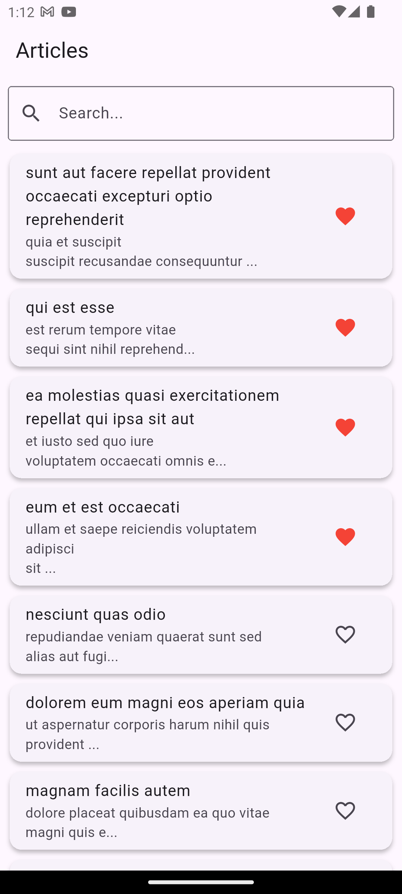
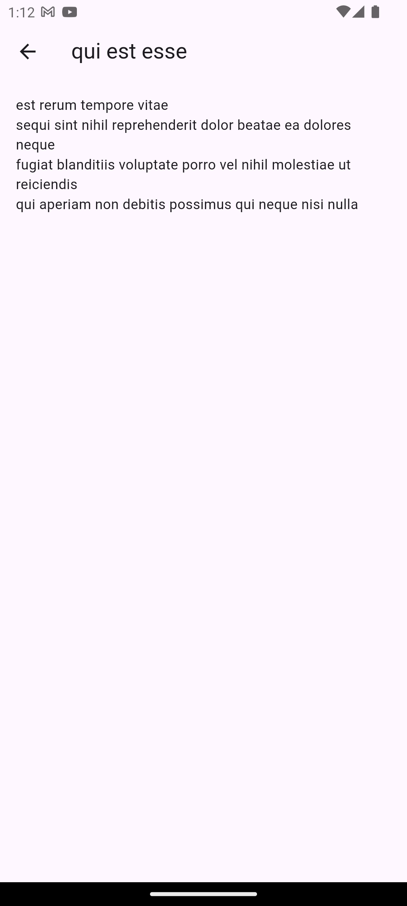
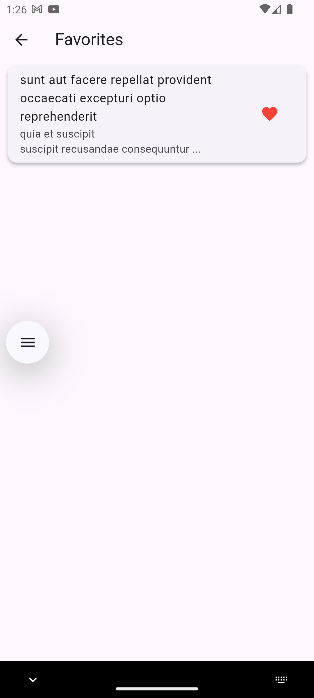

# AssignmentBharatNxt - Flutter Article App

A Flutter application that fetches and displays a list of articles from a public API. Users can search, view details, and mark articles as favorites.

## Features

- ✅ Fetches articles from https://jsonplaceholder.typicode.com/posts
- 🔍 Client-side search by title or body
- 📄 Detail screen with full title and body
- ❤️ Favorite/unfavorite functionality using Hive
- 🔄 Pull-to-refresh
- 💾 Persistent favorites with local storage
- 🌐 Localization-ready (default: English)
- ⚙️ Clean architecture (SOLID principles) with Bloc state management

## Setup Instructions

1. **Clone the repo**
   ```bash
   git clone https://github.com/iamparthsanghani/bharatnext.git
   cd bharatnxrassignmentnext
   ```

2. **Install dependencies**
   ```bash
   flutter pub get
   ```

3. **Generate Hive adapters (if not already)**
   ```bash
   flutter pub run build_runner build --delete-conflicting-outputs
   ```

4. **Run the app**
   ```bash
   flutter run
   ```

## Tech Stack

- **Flutter SDK**: 3.29.3
- **State Management**: Flutter Bloc
- **HTTP Client**: `http` package
- **Persistence**: Hive (with `hive_flutter`)
- **Localization**: Flutter `intl` package

## State Management Explanation

We used the **Flutter Bloc** package to implement reactive state management and separation of concerns. The UI listens to `BlocBuilder` widgets, which rebuild automatically when states change, allowing for a clean and modular data flow.

## Known Issues / Limitations

- ❗ Initial Hive model generation requires manual `build_runner` command
- ❗ Localization is configured but only one language is implemented (English)

## Screenshots 


### Home Screen
  

### Article Detail


